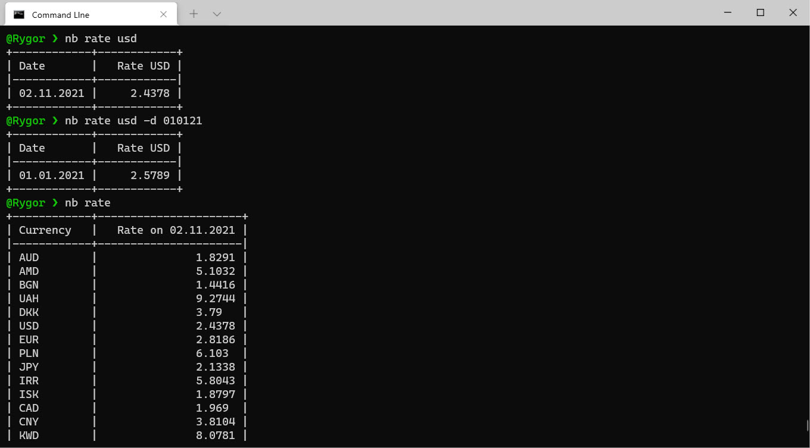
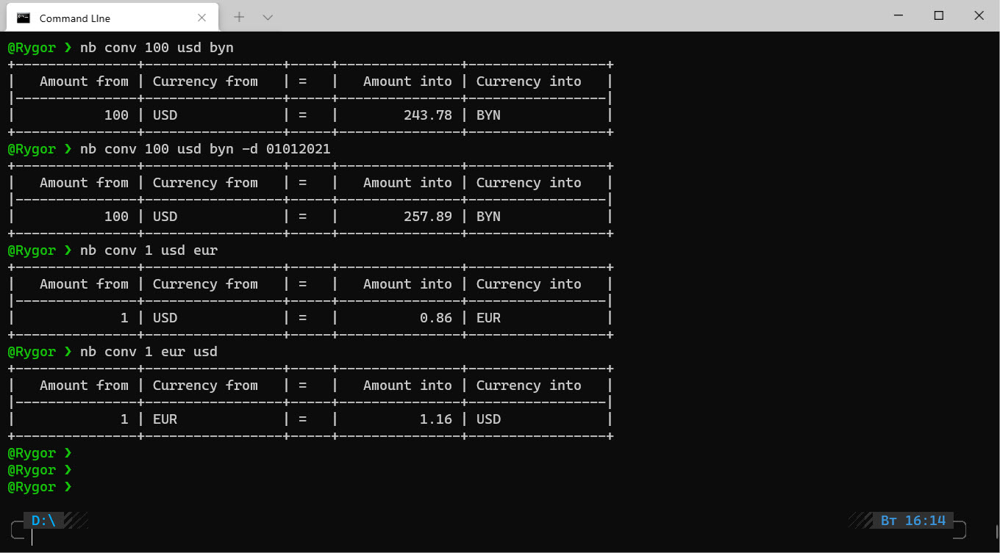
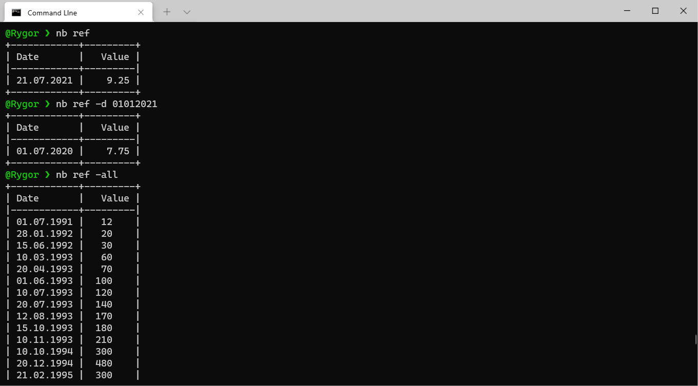

# nb

[](https://www.python.org/downloads/release/python-360/)

[](https://github.com/Rygor83/kalc) [](https://github.com/Rygor83/kalc)

[](https://choosealicense.com/licenses/mit/)

Windows/Linux Command line for obtaining the official exchange rate and the refinancing rate of the Belarusian ruble
against foreign currencies established by the National Bank of the Republic of Belarus

Linux: tested on Windows 10 with WSL Ubuntu and Pycharm.

## Installation

Use the package manager [pip](https://pip.pypa.io/en/stable/) to install foobar.

```cmd
pip install <path to nbrb_by folder>
```

## Usage

```
Usage: nb [OPTIONS] COMMAND [ARGS]...

  Windows Command line for obtaining the official exchange rate and the
  refinancing rate of the Belarusian ruble against foreign currencies
  established by the National Bank of the Republic of Belarus

Options:
  --help  Show this message and exit.

Commands:
  conv  Currency converter
  rate  Exchange rates
  ref   Refinance rate
```

## Examples

### Exchange rates

```
Usage: nb rate [OPTIONS] [CURRENCY]

  Exchange rates

Argument optional: CURRENCY: Currency for which we want to get the exchange rate. 
                   If empty then retrieve all exchange rates.

Options:
  -d, --date TEXT  Get a rate on a date. Possible values: 01.01.2021,
                   01/01/2021, 01-01-2021, 01012021, 010121. If empty then today date used.
  --help           Show this message and exit.
```



### Currency converter

```
Usage: nb conv [OPTIONS] AMOUNT CUR_FROM CUR_TO

  Currency converter

  Required parameters:
  AMOUNT: The amount from which we recalculate, for example: 100
  CUR_FROM: The currency from which we are recalculating, for example: USD
  CUR_TO: Currency to be converted into, for example, EUR

  Example: nb conv 100 usd eur

Options:
  -d, --date TEXT  Conversion date. Possible values: 01.01.2021, 01/01/2021,
                   01-01-2021, 01012021, 010121. If empty then date equal
                   today
  --help           Show this message and exit.
```



### Refinance rate

```
Usage: nb ref [OPTIONS]

  Refinance rate

Options:
  -d, --date TEXT  Get a rate on a date. Possible values: 01.01.2021,
                   01/01/2021, 01-01-2021, 01012021, 010121. If empty then today date used
  -all             Get all Refinance rates
  --help           Show this message and exit.
```



## API help

- [Exchange rate](https://www.nbrb.by/apihelp/exrates)
- [Refinance rate](https://www.nbrb.by/apihelp/refinancingrate)

## Contributing

Pull requests are welcome. For major changes, please open an issue first to discuss what you would like to change.

## License

[MIT](https://choosealicense.com/licenses/mit/)